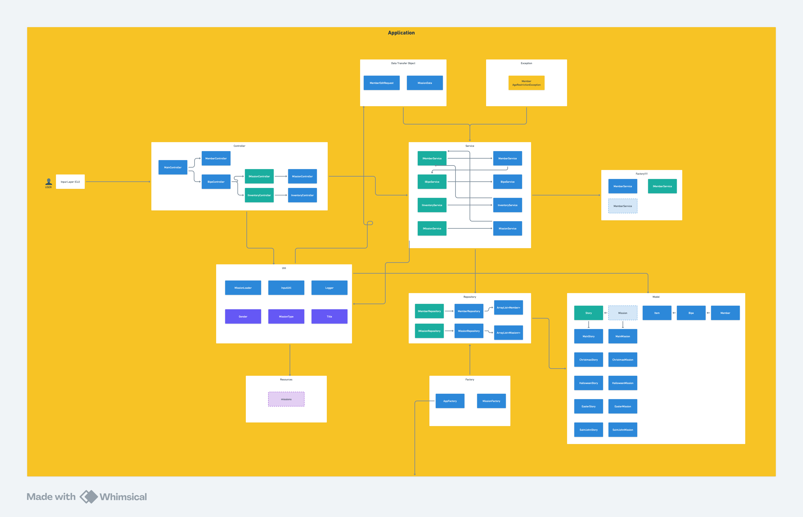

# 🕵️ Midnight Pinewood Club - Sistema de Cadastro Secreto

Este projeto é uma simulação de um sistema de cadastro e gerenciamento de membros do **Midnight Pinewood Club**, um clube secreto fictício onde os membros recebem um **Bipe** ao ingressarem. Este dispositivo lhes permite acessar suas informações, missões e inventário dentro do clube.

---

## 🎯 Funcionalidades Principais

- ✅ Cadastro de Membros com validação de idade (restrição mínima)
- ✅ Logger Singleton para registro de operações
- ✅ Sistema de Missões com leitura via arquivos `.json`
- ✅ Inventário pessoal: itens são adquiridos ao completar missões
- ✅ Sistema de Títulos: membros evoluem conforme completam missões
- ✅ Visualização de missões disponíveis e atribuídas
- ✅ Persistência em tempo de execução com uso de repositórios
- ✅ Controle de fluxo com exceptions customizadas (ex: idade inválida)
- ✅ Registro de novos membros via logger interno

---

## 🔧 Arquitetura e Estrutura do Projeto

O sistema foi desenvolvido com **Java puro**, com o objetivo de praticar conceitos fundamentais e aplicar padrões de projeto.

### 🗂️ Camadas

- **Controller**: Coordena as ações entre a interface do usuário e o domínio
- **Service**: Contém as regras de negócio
- **Repository**: Responsável pela persistência dos dados em tempo de execução
- **Model**: Representa as entidades do sistema (Membro, Missão, Inventário, etc.)
- **UI**: Camada de entrada para o usuário por meio de terminal
- **DTO (Data Transfer Object)**: Facilita a troca de dados entre camadas
- **Factory e Factory Method**: Criação controlada de objetos
- **Singleton**: Utilizado para o Logger centralizado
- **Exception**: Tratamento de erros personalizados

---

## 🧪 Tecnologias e Bibliotecas

- **Java Puro (SE)**
- **Gson**: Para manipulação de arquivos JSON
- **Padrões de Projeto**: Singleton, Factory Method, Factory

---

## 🧠 Objetivo

Este projeto foi desenvolvido com o intuito de **aprender, praticar e consolidar** conhecimentos de:

- Orientação a Objetos em Java
- Estruturação de aplicações em camadas
- Padrões de projeto
- Manipulação de arquivos JSON
- Boas práticas de desenvolvimento

---

## 📌 Imagem Arquitetural



---

## 🚀 Como Rodar

1. Clone o repositório:
   ```bash
   git clone https://github.com/Bernardo-Bertante/-Midnight-Pinewood-Club.git
   cd -Midnight-Pinewood-Club
   
2. Baixe a biblioteca Gson:
   - Acesse: https://repo1.maven.org/maven2/com/google/code/gson/gson/2.10.1/
   - Baixe o arquivo gson-2.10.1.jar
   - Coloque o .jar na raiz do seu projeto (ou em uma pasta lib/, se preferir)


3. Compile o projeto (ajustando o caminho do .jar se necessário):
   ```bash
   javac -cp gson-2.10.1.jar Application.java

4. Execute a aplicação:
   ```bash
   java -cp .:gson-2.10.1.jar Application

* No Windows, substitua : por ; no classpath:
   ```bash
   java -cp .;gson-2.10.1.jar Application
